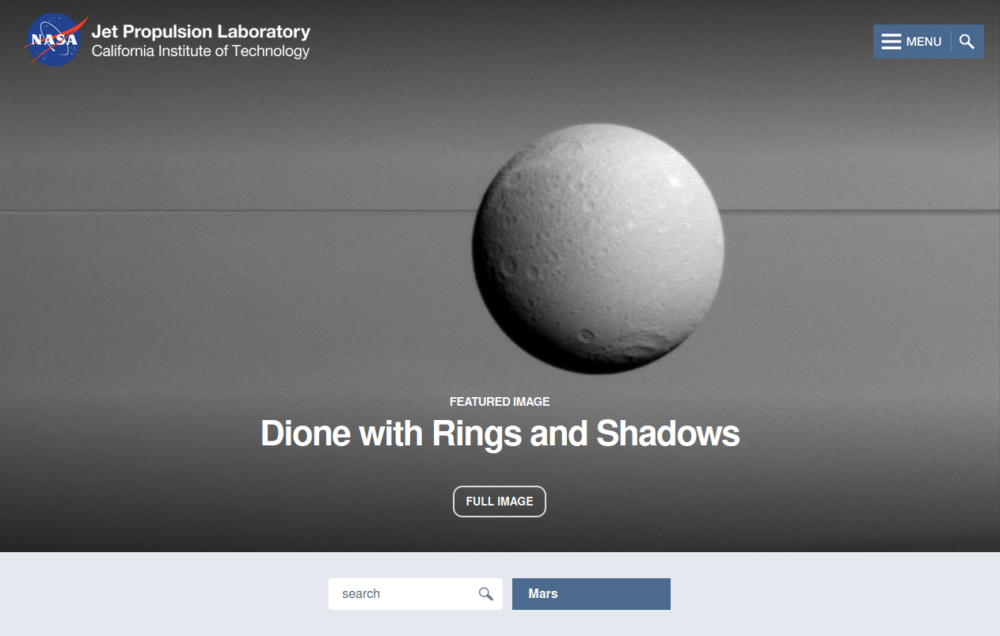
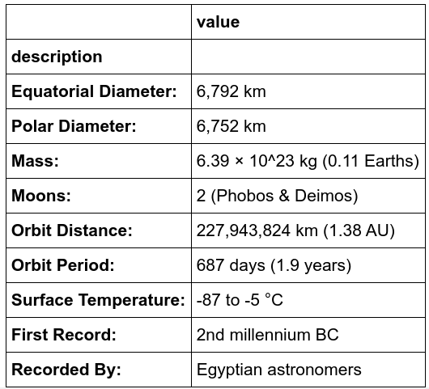

# Mission-to-Mars
Mission to Mars

## Aim
The aim of this project is to scrape the NASA news site to retrieve the communication thread between earth and the Mars Rover. 

## Scraping to retrieve the request

The request message is retrieved in a two-step process:

1. The news site is probed for the existence of a list item element of class *slide* inside an unordered list element of class *item_list*. 
2. If such an element is found, it is probed for the existence of a div element of class *content_title*.
3. If the div element is found, its text contents are retrieved.
4. Next, the text content of the div element of class *article_teaser_body* is retrieved.

## Retrieving image of Mars

To retrieve an image of Mars, the following steps are taken:

1. The browser instance is directed to URL https://www.jpl.nasa.gov/spaceimages/?search=&category=Mars.
2. An element of class *full_image* is retrieved from the browser and the browser is instructed to click() on the element. 

3. On the next page, an element containing text "more info" is clicked to traverse to the full image page.
4. On the next page, the browser instance is reloaded with the contents of that page.
5. On the next page, a URN is retrieved an element identified by the sequence "figure.lede a img" (a figure item of class *lede* which contains an anchor item which itself contains an image item).
6. The URN is concatenated with the NASA's main URI to retrieve the full size image of Mars.

## Space facts

To retrieve the facts on Mars, the following steps are taken:

1. Pandas is used to load the contents of URL http://space-facts.com/mars/ into an array, the first item of which (index 0), are stored in a DataFrame.
2. The column names of the DataFrame are set before it is displayed on the screen.
3. The contents of the DataFrame are retreived as html.
4. The browser instance is terminated.

